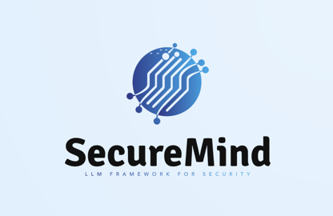

 

  <i>A Framework for Benchmarking Large Language Models in Memory Bug Detection and Repair</i>

  <i>

  </i>

## Introduction

SecureMind: SecureMind provides a customizable and user-friendly interface for defining test plans as Python
scripts, which are then executed to automatically download
and prepare data to benchmark LLMs automatically across a
wide range of evaluation metrics.

## Installation

Prom builds upon:

-	Python 3.10
-	SecLLMHolmes

The system was tested on the following operating systems:

- Ubuntu 20.04

See [INSTALL.md](INSTALL.md) for further details.

## Data

Data are available at [here](./datasets/README.md).

## Contributing

We welcome contributions to Prom. If you are interested in contributing please see
[this document](./CONTRIBUTING.md).

